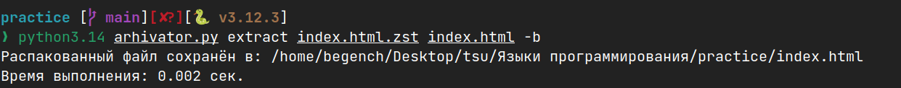
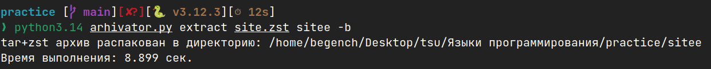

Утилита выполняет упаковку и распаковку файлов и директорий в формате **`.zst`**,  
- Сжатие с помощью **zstd** (`compression.zstd`)
- Архивация файлов **и папок**
- Формат архива — **tar + zstd (`.zst`)**
- Распаковка `.zst` архива в указанную директорию
- Автоматический вывод времени выполнения (`-b`)

```bash
python3.14 arhivator.py compress <source> <archive.zst> -b  
или
python3.14 arhivator.py extract <archive.zst> <source> -b  
```   

- Сжатие файла


- Распаковка файла


- Архивация папки


- Распаковка папки

